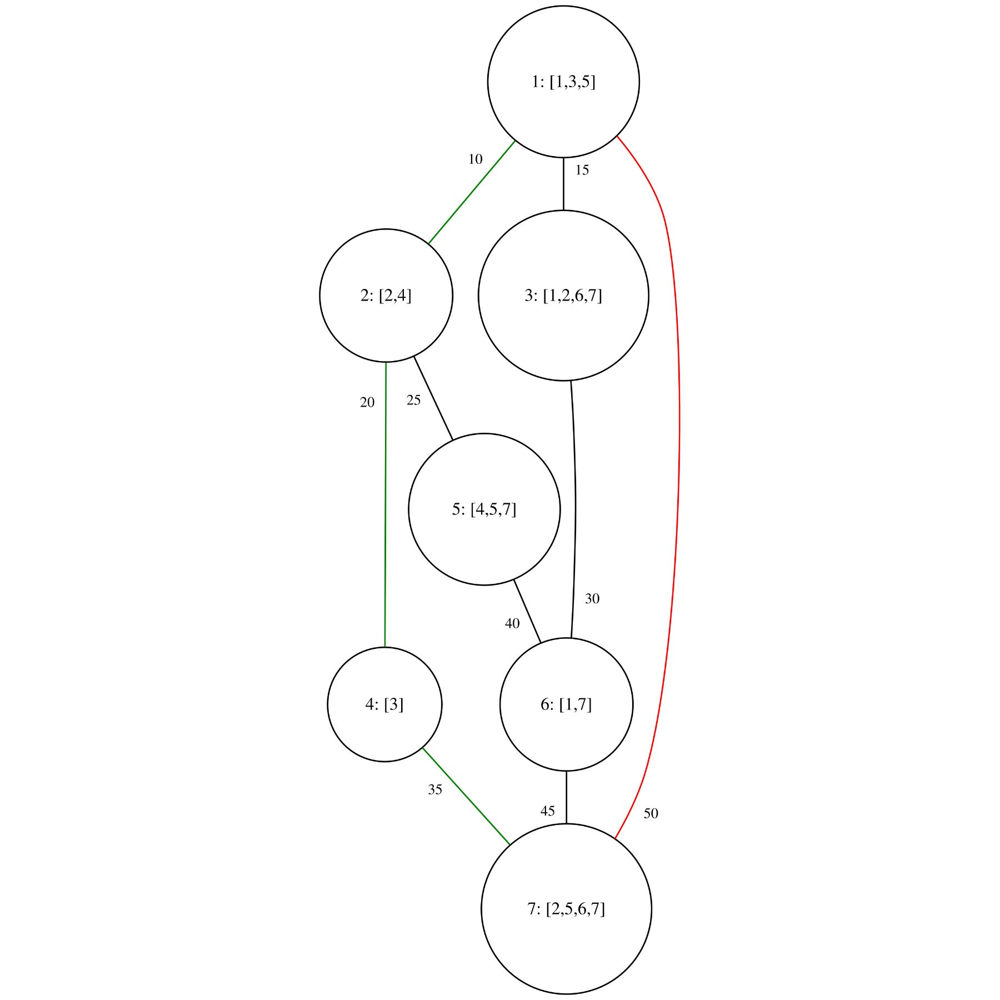
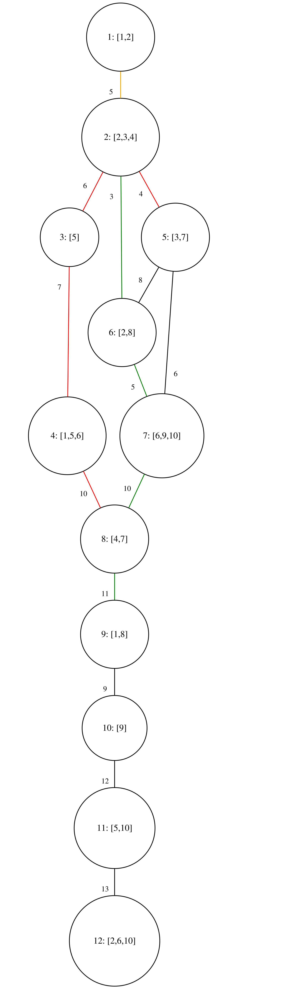

# Shop Network

We are monitoring a number of products in a shop Network, in which each road connecting 2 shops has already a precomputed time cost provided in the input file, in addition, all roads are bidirectional (they go both ways), and we would like to find:

- The minimum time required for exactly 2 agents to buy all available products collectively on a specific day, starting from shop with id 1,and then meeting at a specific shop.
- The path taken by agent 1.
- The path taken by agent 2.

Each path is described as a collection of roads taken by each agent, example: agent 1 goes from shop1 to shop3 then shop 4 then the format is: `1 -> 3 -> 4`

## Extra practical information (<small>not needed for computation</small>)

- the final destination is actually close to a warehouse, that agents use to store products.
- I have chosen road connection and not GPS coordinates, because distance doesn’t mean short time, since in certain areas there is many things that affect time, example traffic, construction …, therefore the time approximation is already precomputed
- I made shop identification numbers and product identification numbers simple, so that you focus more on the algorithm, rather than the pre-processing

## Constraints:
- 2 ≤ total_shops ≤ 5000  
- 1 ≤ total_products ≤ 10
- I made the constraints in that range so that you tingle a specific type of optimization that is useful on that range, in addition I wanted you to start visualizing the limitations of each optimization and each algorithm.
- Example: if we increase the range slightly, then we change the bitmask, but if we change a lot, we make a significant change to the algorithm.

## Algorithm Overview

- **Graph model:** Bidirectional weighted graph with up to 5,000 nodes and 10 products.
- **State space:** `(node, productMask)` where `productMask` is a bitmask of collected products.
- **Algorithm:** Modified Dijkstra’s shortest path to compute minimal time for each state.
- **Path reconstruction:** Backtracks via parent node/mask arrays to produce each agent's route.
- **Meeting point optimization:** Brute force over ≤ 1,024 possible masks to find two disjoint product sets with minimal maximum arrival time.  
  This is the **fastest exact method** for the given constraints (`total_products ≤ 10`), as the full pairwise scan runs in well under a second and no alternative approach would improve runtime.
- **Time complexity:** O(E * 2^P log(V * 2^P)) for Dijkstra, plus O(4^P) mask pairing (fast for P ≤ 10).
- **Space complexity:** O(V * 2^P) distance table.

## Query format:

```text
day: the day we want both agents to buy all available products
meeting shop id: the target shop id, where both agents shall meet eventually
```
## Examples:
### Example 1:

**Query:** `day: Tuesday`, `meetingShopId: 7`

<pre style="
  background-color: #2d2d2d;
  color: #fff;
  /* top right bottom left */
  padding: 1em 1em 0 1em;
  border-radius: 4px;
  font-size: 1.1em;
  line-height: 1;
">
<span style="
  color: rgba(255, 0, 0, 0.8);
  background-color: rgba(255, 255, 255, 0.6);
  padding: 0 0.2em;
  border-radius: 2px;
">Agent 1 path: 1 → 7</span><br>
<span style="
  color: green;
  background-color: rgba(255, 255, 255, 0.6);
  padding: 0 0.2em;
  border-radius: 2px;
">Agent 2 path: 1 → 2 → 4 → 7</span><br><br>
Minimal time to gather all possible products collectively on Tuesday and meet at node 7 is:<br>
<span style="
  color: green;
  background-color: rgba(255, 255, 255, 0.6);
  padding: 0 0.2em;
  border-radius: 2px;
">10 + 20 + 35 = 65</span>
</pre>




### Example 2:

**Query:** `day: Friday`, `meetingShopId: 8`

<pre style="
  background: #2d2d2d;
  color: #fff;
  /* top right bottom left */
  padding: 1em 1em 0 1em;
  border-radius: 4px;
">
<span style="
  color: rgba(255, 0, 0, 0.8);
  background-color: rgba(255, 255, 255, 0.6);
  padding: 0 0.2em;
  border-radius: 2px;
">Agent 1 path: 1 → 2 → 5 → 2 → 3 → 4 → 8</span><br>
<span style="
  color: green;
  background-color: rgba(255, 255, 255, 0.6);
  padding: 0 0.2em;
  border-radius: 2px;
">Agent 2 path: 1 → 2 → 6 → 7 → 8 → 9 → 8</span><br><br>
Minimal time to gather all possible products collectively on Tuesday and meet at node 7 is:<br>
<span style="
  color: green;
  background-color: rgba(255, 255, 255, 0.6);
  padding: 0 0.2em;
  border-radius: 2px;
">5 + 3 + 5 + 10 + 11 + 11 = 45</span>
</pre>



